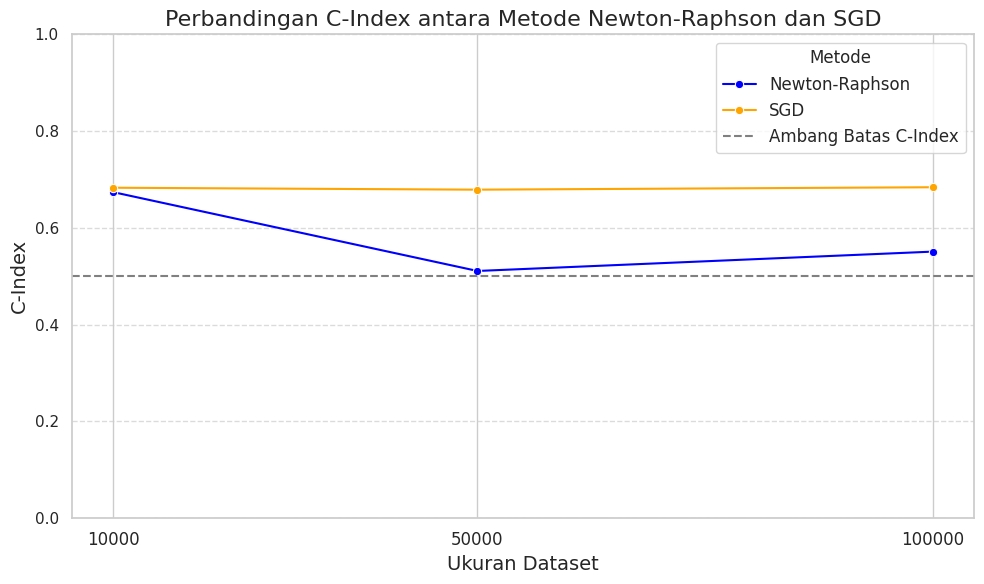

# Cox Proportional Hazards Estimation using SGD

This project demonstrates parameter estimation for the Cox Proportional Hazards model using two optimization methods: **Newton-Raphson** and **Stochastic Gradient Descent (SGD)**. The implementation utilizes the PyCox library and synthetic datasets of varying sizes.

## Objective

To compare the performance of Newton-Raphson and SGD in estimating Cox model parameters, especially as the dataset size increases.

## Key Results

- **SGD consistently outperformed Newton-Raphson** on larger datasets in terms of C-Index performance.
- Performance was evaluated using the **C-Index metric**, commonly used in survival analysis.
- The notebook includes a clear visualization comparing both methods across datasets of size 10k, 50k, and 100k.

## Tools & Libraries

- Python
- PyCox
- Pandas
- Matplotlib
- Seaborn

## File

- `SGD_for_Survival_Model_Parameter_Estimation_(PyCox).ipynb`  
  → Contains the full analysis, model training, evaluation, and plots.

## Visualization

The project includes a line plot comparing C-Index across methods and dataset sizes:

 <!-- Optional: if you add an image -->

## Author

[Dion Orlando Sitohang](https://github.com/dionrlnd)
